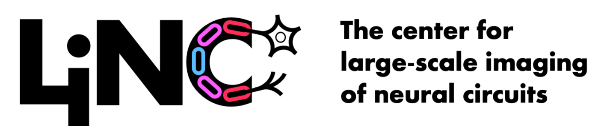

# Welcome to the LINC Documentation

The center for [Large-scale Imaging of Neural Circuits (LINC)](https://connects.mgh.harvard.edu/)
 (PIs: Haber, Hillman, Yendiki) is funded by the
 [NIH BRAIN Initiative CONNECTS program](https://www.ninds.nih.gov/news-events/highlights-announcements/nih-brain-initiative-launches-projects-develop-innovative-technologies-map-brain-incredible-detail).
Its goal is to develop novel technologies for imaging brain connections down to 
the microscopic scale, and deploy these technologies to image 
cortico-subcortical projections that are relevant to deep brain stimulation for 
motor and psychiatric disorders.

The LINC project is a collaboration between 8 institutions: Brigham and Women’s 
Hospital (PI: Fox), Columbia University (PI: Hillman), Harvard University (PI: 
Lichtman), Massachusetts General Hospital (PI: Yendiki), Massachusetts Institute
 of Technology (PI: Ghosh), University College London (PI: Walsh, co-PI: Lee), 
 University of Rochester (PI: Haber), and Weill Cornell Medicine (PI: Wu).
